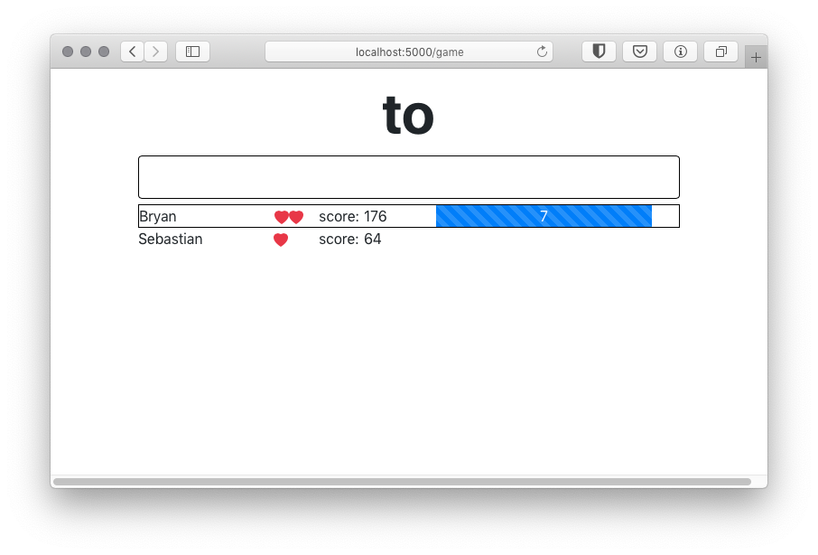

# WordBomb
A web-based, multiplayer word game

You have ten seconds to type a word that contains two random, consecutive letters.
Scoring is based on the rarity of the two letters.

Written with Python 3.8, but should work with 3.7

Uses websockets and redis
